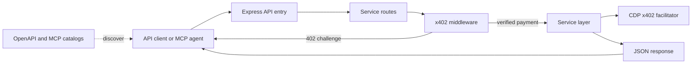

# x402 API Portfolio

Five paid REST services and a web scraper, protected by x402 payments in USDC on Base. The portfolio is deployed at [`x402-api-91r3.vercel.app`](https://x402-api-91r3.vercel.app). Service implementations are launch stubs where indicated by their response data; review each service before using results in production decisions.

## Architecture



The standalone scraper follows `src/routes` → `src/middleware` and `src/services`, with payment and network settings in `src/config`. The five marketplace services remain isolated workspaces under `services/`, sharing `shared/x402-middleware` and `shared/service-runtime`. Vercel composes the services through `api/portfolio.ts`.

## API reference

All listed operations require payment unless noted. An unpaid call returns HTTP 402 with `PAYMENT-REQUIRED`; send the signed payment in `X-PAYMENT` to retry. Successful paid responses include `PAYMENT-RESPONSE`.

| Endpoint | Description | Price (USDC) |
| --- | --- | ---: |
| `GET /api/scraped-data?target={url}` | Scrape a public HTTP(S) page | $0.01 |
| `GET /alpharoute/api/v1/quote` | Quote a Base token route | $0.015 standard; $0.12 above 10,000 input units |
| `POST /alpharoute/api/v1/execute` | Submit route execution | $0.50 + 0.03% notional |
| `GET /alpharoute/api/v1/route-status/{routeId}` | Read route status | $0.001 |
| `GET /sentinelfeed/api/v1/events` | Fetch topic events | $0.005 standard; $0.08 realtime |
| `GET /sentinelfeed/api/v1/entities/{entityId}/mentions` | Fetch entity mentions | $0.01 |
| `POST /sentinelfeed/api/v1/stream/subscribe` | Start prepaid event stream | $5.00 |
| `GET /complyrail/api/v1/screen/wallet/{address}` | Screen a wallet | $0.01 |
| `GET /complyrail/api/v1/screen/transaction` | Screen transaction and return attestation | $0.35 |
| `POST /complyrail/api/v1/attest/batch` | Create batch attestations | $0.10 |
| `POST /distillforge/api/v1/infer/classify` | Classify text | $0.0002 / 1K tokens; $0.001 minimum |
| `POST /distillforge/api/v1/infer/extract` | Extract fields from a document | $0.002 / 1K tokens; $0.001 minimum |
| `POST /distillforge/api/v1/infer/reason` | Produce structured risk reasoning | $0.02 / 1K tokens; $0.001 minimum |
| `GET /distillforge/api/v1/models` | List inference models | $0.001 |
| `POST /proofmesh/api/v1/verify/zkproof` | Submit a zkML proof job | $1.50 |
| `POST /proofmesh/api/v1/verify/teeattest` | Verify a TEE attestation | $0.03 |
| `GET /proofmesh/api/v1/verify/status/{proofId}` | Poll proof status | $0.001 |
| `GET /health` | Check service availability | Free |

Machine-readable contracts: [OpenAPI](docs/openapi.json) and [MCP discovery](.well-known/mcp.json). The catalogs are generated from the repository's API definition and MCP tool manifest with `npm run generate:spec`.

## Client examples

These show a basic request; complete the x402 402 challenge and retry with `X-PAYMENT` using an x402-compatible client.

```python
import httpx; r = httpx.get("https://x402-api-91r3.vercel.app/api/scraped-data", params={"target": "https://example.com"}); print(r.status_code, r.json())
```

```javascript
const r = await fetch("https://x402-api-91r3.vercel.app/api/scraped-data?target=https%3A%2F%2Fexample.com"); console.log(r.status, await r.json());
```

```bash
curl -i 'https://x402-api-91r3.vercel.app/api/scraped-data?target=https%3A%2F%2Fexample.com'
```

## Local development

Requires Node.js 22 or newer. Copy `.env.example` to `.env` and set a valid treasury address and CDP facilitator credentials.

```bash
npm install
npm run build:all
npm run dev:alpharoute
```

Run the scraper server with `npm run dev`. The MCP stdio adapter is built and run with `npm run build && npm run mcp`; set `AGENT_WALLET_PRIVATE_KEY` locally for signed tool calls. Never commit private keys.

## Registry publishing

The GitHub Action validates the OpenAPI and MCP catalogs on main pushes and published releases. To send the OpenAPI document to a registry, configure the repository secret `X402_REGISTRY_WEBHOOK` with that registry's HTTPS POST endpoint. The workflow sends `docs/openapi.json` as `application/json`.

The weekly **Auto Submit to Registries & Awesome Lists** workflow searches GitHub for public resource lists, skips repositories that disallow forks or were already submitted, and opens up to three documentation pull requests per run. Configure the repository secret `GH_AUTOMATION_TOKEN` with a token that can fork public repositories, open pull requests, and update this repository's submission tracker. Run it manually from the Actions tab when needed. Each accepted pull request URL is recorded in `.github/submitted-registries.json`.
